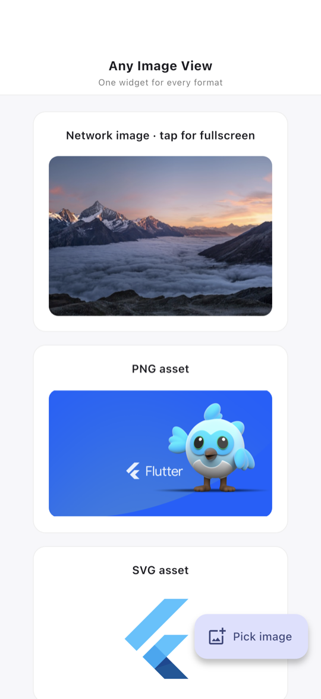
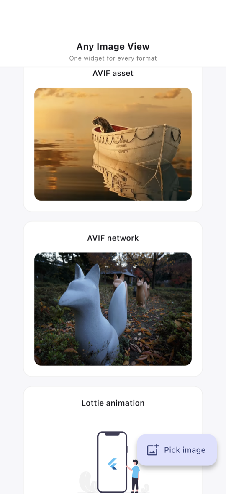
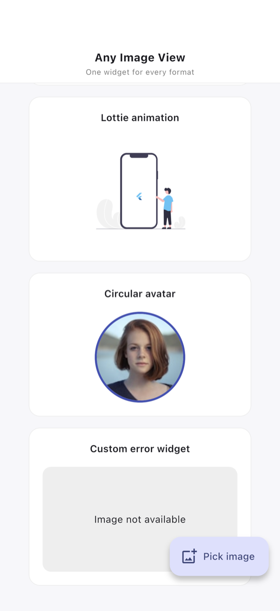
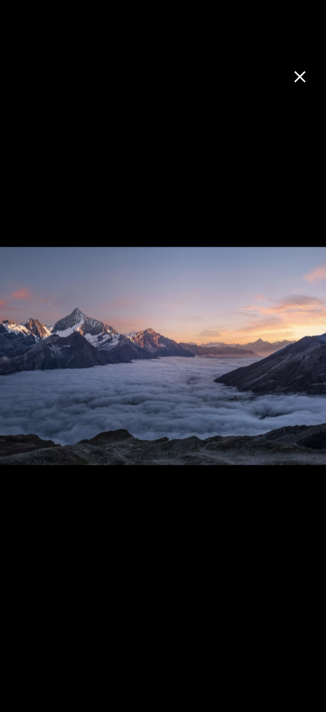

# any_image_view

[](https://pub.dev/packages/any_image_view)
[](LICENSE)

<p align="center">
  
</p>

Show any image with one widget. Network, asset, file, `XFile`, SVG or Lottie:
hand it to `AnyImageView` and it takes care of loading, caching, retries and
errors. Zero dependencies.

## Install

```yaml
dependencies:
  any_image_view: ^2.5.0
```

```dart
import 'package:any_image_view/any_image_view.dart';
```

## Usage

```dart
// Network (cached on disk after the first load)
AnyImageView(imagePath: 'https://example.com/photo.jpg', height: 200, width: 200)

// Asset
AnyImageView(imagePath: 'assets/photo.png', height: 200, width: 200)

// SVG, asset or network, optionally tinted
AnyImageView(imagePath: 'assets/icon.svg', height: 40, width: 40, svgColor: Colors.blue)

// Lottie, loops automatically
AnyImageView(imagePath: 'assets/loader.json', height: 120, width: 120)

// Local file or image_picker result
AnyImageView(imagePath: '/path/to/photo.jpg', height: 200, width: 200)
AnyImageView(imagePath: pickedXFile, height: 200, width: 200)

// Circular avatar
AnyImageView(imagePath: url, height: 80, width: 80, shape: BoxShape.circle)

// Tap for a fullscreen viewer with pan, pinch and double-tap zoom
AnyImageView(imagePath: url, height: 200, width: 200, enableFullscreen: true)

// Styling and custom states
AnyImageView(
  imagePath: url,
  height: 200,
  width: 300,
  fit: BoxFit.cover,
  borderRadius: BorderRadius.circular(16),
  placeholderWidget: const CircularProgressIndicator(),
  errorWidget: const Icon(Icons.broken_image),
)
```

## Supported formats

| Type | Formats |
|------|---------|
| Raster | PNG, JPG, WebP, GIF, BMP, ICO |
| Platform-decoded | AVIF, HEIC on Android 12+, iOS 16+, macOS 13+ and web |
| Vector | SVG |
| Animation | Lottie `.json`, `.zip`, `.lottie` |
| Sources | Network URL, asset, file path, `file://` URI, `XFile`, `File` |

The source is detected from the path. Matching is case-insensitive and
ignores query strings and fragments.

## Parameters

| Parameter | Type | Default | Purpose |
|-----------|------|---------|---------|
| `imagePath` | `Object?` | | URL, asset path, file path, `XFile` or `File` |
| `height`, `width` | `double?` | | Size |
| `fit` | `BoxFit?` | `cover` | How the image fills the box (`contain` for SVG and Lottie) |
| `alignment` | `Alignment?` | | Alignment inside the container |
| `shape` | `BoxShape` | `rectangle` | `rectangle` or `circle` |
| `borderRadius` | `BorderRadius?` | | Rounded corners |
| `border` | `BoxBorder?` | | Border |
| `boxShadow` | `List<BoxShadow>?` | | Shadows |
| `margin`, `padding` | `EdgeInsetsGeometry?` | | Outer and inner spacing |
| `placeholderWidget` | `Widget?` | shimmer | Shown while loading |
| `errorWidget` | `Widget?` | broken-image icon | Shown on failure |
| `fadeDuration` | `Duration` | 400 ms | Fade-in |
| `maxRetryAttempts` | `int` | 3 | Retries after a failed network load; `0` disables |
| `httpHeaders` | `Map<String, String>?` | | Headers for network requests |
| `enableZoom` | `bool` | `false` | Inline pinch-to-zoom |
| `enableFullscreen` | `bool` | `false` | Tap opens a fullscreen viewer |
| `onTap` | `VoidCallback?` | | Custom tap handler |
| `svgColor` | `Color?` | | Tint for SVGs |
| `svgColorFilter` | `ColorFilter?` | | Custom SVG color filter |

## Screenshots

| Network, PNG, SVG | AVIF | Lottie, avatar, error | Fullscreen |
|:---:|:---:|:---:|:---:|
|  |  |  |  |
